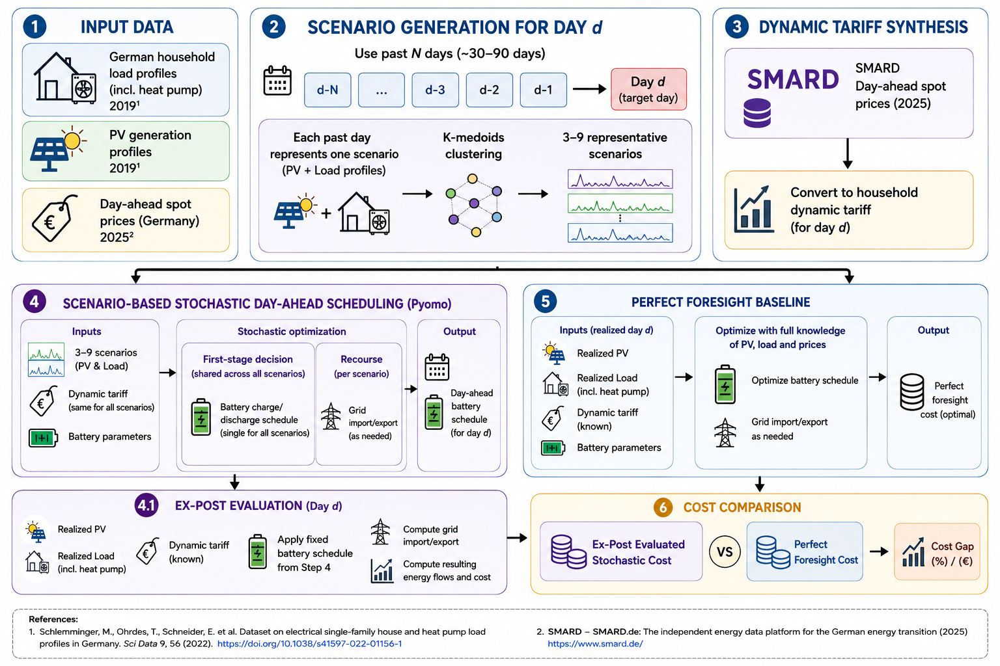

# 🔋 energy_system_optimizer

This project offers:
1) an **optimization engine** (*deterministic and two-stage stochastic optimization*) for the operation of systems with photovoltaic (PV) generation, batteries, and grid exchange
2) a FastAPI service to obtain day-ahead schedules for household **battery dispatch**

## Introduction

An Energy Management System (EMS) is a network of hardware and software that monitors, analyzes, and controls energy flows across connected systems. It is useful for scheduling the grid exchange (import/export) and/or battery exchange (charge/discharge) to minimize energy costs by making better use of battery energy storage system (BESS) and generated renewable energy. Industries or households, any entity with a BESS and PV generation can benefit from an EMS, especially when they are on **dynamic electricity tariffs**. *The optimization engine provided in this project is a core component of an EMS.*

<!-- charging and discharging the battery based on the consumption profile and energy prices. -->

### Dynamic electricity tariffs 
Dynamic electricity tariffs allow consumers to adjust their energy consumption based on price signals. That means the price of electricity can vary throughout the day and consumers can save money by consuming more energy when prices are low and less when prices are high (representative infographic below).

<div style="text-align: center;">
  
</div>

Although such electricity contracts are common in industrial and commercial settings, they are still relatively new to households in Germany.
> Since 1 January 2025, all electricity providers in Germany have been legally required to offer dynamic electricity tariffs. However, a 2024 survey showed that over 80% of German households still feel poorly informed about dynamic electricity tariffs [[ffe](https://www.ffe.de/en/publications/series-of-articles-dynamic-electricity-tariffs-tariff-types-advantages-and-disadvantages-technical-requirements/), [vzbv](https://www.vzbv.de/pressemitteilungen/dynamische-stromtarife-19-millionen-haushalte-im-dunkeln)].


### Typical EMS pipeline
While consumers can already reduce costs under dynamic tariffs by shifting demand to low-price hours, an EMS can optimize battery and grid operations to achieve further savings (~15-36% savings in households [[gridx](https://www.gridx.ai/press-releases/smart-electric-heating-slashes-costs-by-up-to-60-percent-and-fires-up-heat-pump-adoption#:~:text=The%20study%20found%20that%20if,1%2C390%20euros%2C%20or%2060%20percent.), [belinus](https://www.belinus.com/post/real-time-energy-management-36-percent-savings#:~:text=Metric,environmental%20impact%20is%20real%20too.)]). An EMS generally consists of a forecasting module to predict future load, PV generation, and energy prices, and an optimization module that uses these forecasts to determine the optimal decisions. 

Below is an example of a modern EMS implementation:

```
[Historical Data & Real-Time Weather API] 
                 │
                 ▼
[Scenario Generation (GMMs / LSTMs / Markov Processes)]
                 │
                 ▼
[Scenario Reduction (e.g., K-Means or Backward Reduction)]
                 │
                 ▼
★★★★ Optimization - PROJECT FOCUS ★★★★
                 └──► Minimizes: $Cost_{Grid} + Degradation_{Battery}$
                 │
                 ▼
[Receding Horizon Execution (Apply Step 1, Repeat in 15 mins)]

```

## Project Overview

This project provides a reusable optimization backend, which is additionally adapted for the application of battery scheduling in households. Furthermore, it includes an empirical study.

### 1) esms package (optimization backend)
The `esms` package contains the optimization engine (implemented using **Pyomo**) for energy dispatch problems with PV generation, batteries, and grid exchange. It includes:
- ⚡ deterministic mixed-integer linear programming (MILP) optimization
- 🎲 two-stage stochastic MILP optimization from explicit scenarios
- support for multiple batteries, battery degradation costs, separate import/export prices, arbitrary time resolution, and optional fixed decisions
- tested with **SCIP** (> 8.0.2) and **GLPK** solvers (both included in the Docker image)

Read more → [Mathematical models](./docs/OPTIMIZATION.md)

### 2) Household battery scheduling (API + frontend)
The optimization engine is adapted for the use-case of household battery dispatch and exposed through a **FastAPI service**. Furthermore, it is paired with a **Streamlit frontend** for file upload, execution, and visualization. The API accepts battery parameters and time-series inputs, then returns day-ahead battery schedules suitable for practical use and testing. Read more → [API docs](./docs/API_README.md)

Live API: https://esms-chft.onrender.com/

Streamlit frontend: https://esms-house-battery-schedule.streamlit.app/


### 3) Study scope and evaluation
The study applies this stack to a German residential use case with dynamic tariffs. It covers: 
- ingesting and preprocessing historical household data from open source datasets [[1](https://doi.org/10.5281/zenodo.14918474), [2](https://doi.org/10.1038/s41597-022-01156-1)], and energy prices from SMARD
- **K-medoids clustering** for scenario generation
- **two-stage stochastic optimization** using generated scenarios to optimize the *battery schedule*
- **champion-challenger strategy** to finalize the policy for stochastic scheduling
- comparing against perfect foresight

The goal is to evaluate cost savings and operational KPIs under realistic uncertainty assumptions.

#### Specific Problem Statement

> This project generates and evaluates day-ahead battery dispatch schedules for a **German residential household** with rooftop PV generation. The objective is to minimize electricity costs under dynamic tariffs while accounting for uncertainty in future household consumption (load) and PV generation.

## Study, Results, & Limitations

#### Data Sources

The study combines two independent datasets:

* **Household Load and PV Data (2019)**
  German single-family household electricity consumption and heat pump load profiles from: Schlemminger, M., Ohrdes, T., Schneider, E. et al. *Dataset on electrical single-family house and heat pump load profiles in Germany*. Scientific Data, 9, 56 (2022).

* **Electricity Prices (2025)**
  German day-ahead spot market prices obtained from SMARD and transformed into synthetic household dynamic tariffs.

The analysis assumes that household consumption and PV generation patterns observed in 2019 remain representative under 2025 market conditions.

#### Strategy
The implemented EMS strategy focuses on **day-ahead battery dispatch scheduling**: obtain the battery schedule for the next day and then follow the schedule without any adjustments during the day. If the load is more or the PV generation is less than expected, the grid import and cost would rise, and vice versa.

An alternative strategy is to fix the **day-ahead grid exchange** (import/export) instead. That approach typically requires adjusting the battery schedule during execution and in extreme cases, load shedding or curtailing PV generation to meet the fixed grid exchange schedule. As this is undesirable, this strategy is not implemented in this project but can be explored in future work.

#### Target Variable

The target variable is the *percentage cost saved* by using a battery energy storage system together with an EMS, compared to a baseline scenario without battery storage.

```math
\text{Cost Savings (\%)} = \frac{\text{Cost}_{\text{no battery}} - \text{Cost}_{\text{with battery + EMS}}}{\text{Cost}_{\text{no battery}}} \times 100
```

**NOTE:** The implemented EMS strategy is not a full-fledged system, but only focuses on the day-ahead battery scheduling. *Ideally, the cost savings here should be evaluated against a baseline with a battery (e.g., a simple rule-based strategy) rather than the no-battery scenario, but this is left for future work.* 

### Workflow


**NOTE:** The infographic is generated with ChatGPT. While the general workflow is correct, some details may be inaccurate. See the [scripts](./scripts/), [docs](./docs/) and the [make](./Makefile) file for the exact logic, reasoning, and data used in each step. Read more → [Workflow summary](./docs/WORKFLOW_SUMMARY.md)

### Results: *How much money can be saved?*

- Considering a household on a dynamic electricity tariff with a PV system and a BESS, the cost savings from using an EMS depend on various factors, including the size of the PV system, the capacity of the battery, etc. Read config files ([battery](./config/sonnenBatterie10.json), [optimization](./config/stochastic_optimization_config.yaml)) and docs ([DECISIONS](./docs/DECISIONS.md)) for the parameters used in the experiments. 

- Since the prices considered in the experiments are derived based on assumptions, the absolute cost savings (e.g., in euros) may not be meaningful. Instead, relative cost savings (e.g., percentage reduction) are presented which are more informative. **NO CLAIMS ARE MADE**.

- **Analysis time period**: 275 days (Apr, 2025 - Dec, 2025) with data resolution of 15 minutes.

- **Perfect foresight** represents the theoretical upper bound of cost savings, where the future load, PV generation, and energy prices are perfectly known in advance.

### 1) Number of Scenarios (Uncertainty Modelling) and Cost Savings
**Why this matters:** The number of scenarios used in the stochastic optimization and method of generation significantly impact the performance of the EMS. More scenarios can capture a wider range of possible future outcomes, but also increase computational complexity. Also, it gives an idea of how much historical data is required.

**Observations:** The cost savings increase with the number of scenarios, but with diminishing returns. The best stochastic policy **(20 scenarios) achieves around 3.87%**, while 11.91% reduction is possible with perfect foresight.


Two scenario generation approaches are compared here: (1) generating `N` scenarios of day-ahead load and PV generation using past `P` days (left), and (2) taking the past `P` days directly as scenarios (right). The latter approach performed better suggesting that *relying on the immediate past may be more informative for forecasting the next day than on a wider historical window, within the structure of the implemented EMS strategy.*

### 2) Key Performance Indicators

| Metric/Key | No Battery | **Battery + (best) Stochastic Policy** | Battery + Perfect Foresight |
|---|---:|---:|---:|
| **System Inputs (same)** |  |
| dt_hours | 0.25 | 0.25 | 0.25 |
| total_load_kwh | 7706.76 | 7706.76 | 7706.76 |
| total_pv_generation_kwh | 3619.09 | 3619.09 | 3619.09 |
| **Costs** |  |  |  |
| total_eur | 2015.83 | 1937.88 | 1775.69 |
| net_grid_eur | 2015.83 | 1850.36 | 1668.51 |
| battery_degradation_eur | 0.00 | 87.52 | 107.18 |
| reduction (%) | 0.00 | **3.87** | 11.91 |
| **Performance KPIs** |  |  |  |
| self_consumption_ratio | 0.49 | **0.63** | 0.77 |
| self_sufficiency_ratio | 0.23 | **0.29** | 0.36 |
| grid_dependency_ratio | 0.77 | **0.73** | 0.65 |
| **Battery Usage** |  |  |  |
| battery_throughput_kwh | 0.00 | 1750.41 | 2143.55 |
| estimated_equivalent_cycles | 0.00 | 105.65 | 119.09 |

<!-- | total_grid_import_kwh | 5933.80 | 5590.43 | 5027.15 |
| total_grid_export_kwh | 1846.13 | 1413.05 | 829.62 |
| pv_self_consumed_kwh | 1772.96 | 2281.62 | 2789.47 | 
| load_served_locally_kwh | 1772.96 | 2263.82 | 2781.03 | -->

**Why these matter:** Along with cost savings, EMS performance is evaluated using metrics such as **self-consumption ratio** (share of PV consumed locally), **self-sufficiency ratio** (share of load served by local generation), and **grid dependency ratio** (share of load served by the grid). These metrics support decision-making and help choose suitable PV and battery configurations for a household.

<!-- grid dependency ratio and self-sufficiency ratio may add up to more than 1 because the battery can charge from the grid and discharge to serve the load, which causes energy losses.  -->

### 3) Daily Cost Comparison
**Why this matters:** Understanding how cost savings vary over time (e.g., by season) shows whether benefits are consistent or concentrated in specific periods. This helps identify when the EMS is most effective and where improvements are needed.

**Observations:** Cost savings are not uniform across days. In winter, limited PV generation leads to minimal savings, and in summer, higher PV generation enables larger savings. However, *the current EMS strategy does not fully capture this potential, suggesting room for improvement in optimization logic and/or forecasting accuracy.*


## Future work includes:
- Implementing and comparing different forecasting methods (e.g., LSTMs, GMMs, Markov processes) for scenario generation.
- Revenue from energy export is not considered in the current implementation, arbitrage opportunities (buy low, sell high) can be explored in future work.
- Implementing Model Predictive Control (MPC)-based receding horizon control, where the optimization is repeated every 15 minutes with updated forecasts and system states, rather than following a fixed day-ahead battery schedule.

