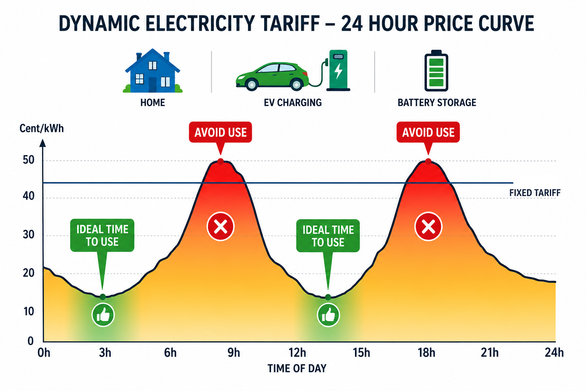
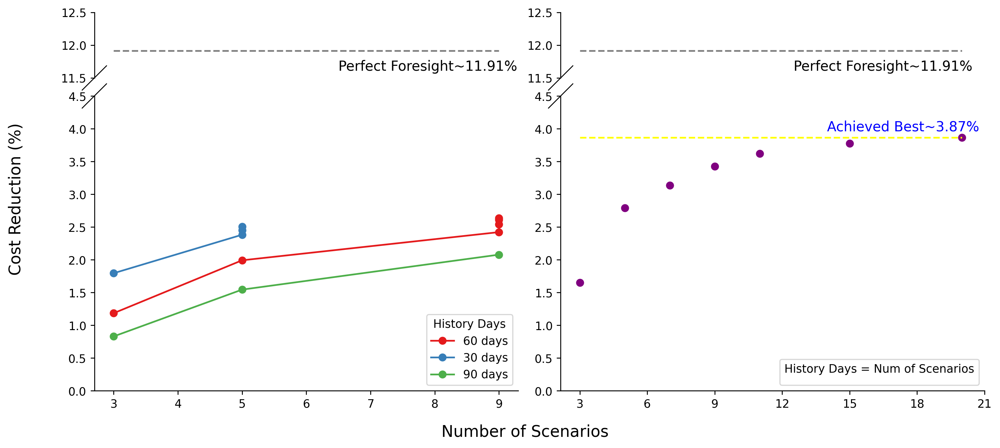
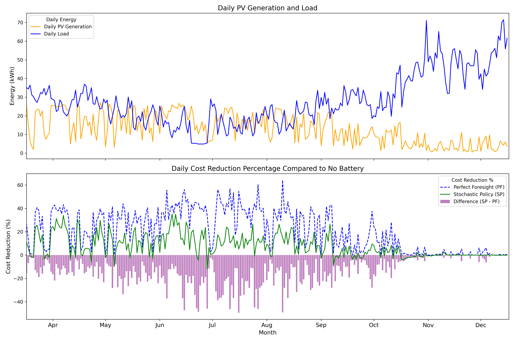

# 🔋 EsMS - Energy (Storage) Management System

*Implementation of an energy management system (EMS) for optimizing the operation of a multi-asset entity with photovoltaic (PV) generation, battery storage, and grid exchange.*

An EMS is useful to schedule the grid exchange (import/export) and/or battery exchange (charge/discharge) so as to minimize energy costs by making better use of battery energy storage system (BESS) and generated renewable energy. Industries or households, any entity with a BESS and PV generation can benefit from an EMS, especially when they are on **dynamic electricity tariffs**. The EMS can help reduce the net energy costs by strategically deciding when to import from the grid, cosume solar locally, discharge the battery, etc.

<!-- charging and discharging the battery based on the consumption profile and energy prices. -->

### Dynamic electricity tariffs 
Dynamic electricity tariffs allow consumers to adjust their energy consumption based on price signals. That means the price of electricity can vary throughout the day and consumers can save money by consuming more energy when prices are low and less when prices are high (representative infographic below).

<!-- (~30% compared to fixed tariffs [[luox](https://www.luox-energy.de/en/zuhause/dynamischer-stromtarif), [ostrom](https://www.ostrom.de/en/dynamic-pricing)]) -->

<div style="text-align: center;">
  
</div>

Although such electricity contracts are common in industrial and commercial settings, they are still relatively new to households in Germany.
> Since 1 January 2025, all electricity providers in Germany have been legally required to offer dynamic electricity tariffs. However, a 2024 survey showed that over 80% of German households still feel poorly informed about dynamic electricity tariffs [[ffe](https://www.ffe.de/en/publications/series-of-articles-dynamic-electricity-tariffs-tariff-types-advantages-and-disadvantages-technical-requirements/), [vzbv](https://www.vzbv.de/pressemitteilungen/dynamische-stromtarife-19-millionen-haushalte-im-dunkeln)].

<!-- Dynamic electricity prices are often tied to spot market prices, such as those on the day-ahead market, and therefore fluctuate similarly to the spot market. -->

<!-- Many countries, including Germany, offer residential customers the option to select flexible dynamic electricity contracts, where tariffs vary over time based on market conditions and supply-demand balance. At the same time, governments have encouraged the adoption of PV systems to increase renewable energy generation and self-consumption. In this context, an EMS can be used to schedule the battery energy storage system (BESS) so as to minimize energy costs by making better use of PV and other renewable generation, while accounting for the cost of importing from and exporting to the grid. The EMS can help reduce peak demand charges by strategically charging and discharging the battery based on the load profile and energy prices. -->
### Typical EMS Pipeline
While consumers can already reduce costs under dynamic tariffs by shifting demand to low-price hours, an EMS can optimize battery and grid schedules to achieve further savings (~15-36% savings in households [[gridx](https://www.gridx.ai/press-releases/smart-electric-heating-slashes-costs-by-up-to-60-percent-and-fires-up-heat-pump-adoption#:~:text=The%20study%20found%20that%20if,1%2C390%20euros%2C%20or%2060%20percent.), [belinus](https://www.belinus.com/post/real-time-energy-management-36-percent-savings#:~:text=Metric,environmental%20impact%20is%20real%20too.)]). An EMS generally consists of a forecasting module to predict future load, PV generation, and energy prices, and an optimization module that uses these forecasts to determine the optimal schedule. 

Below is an example of a modern EMS implementation:

```
[Historical Data & Real-Time Weather API] 
                 │
                 ▼
[Scenario Generation (GMMs / LSTMs / Markov Processes)]
                 │
                 ▼
[Scenario Reduction (e.g., K-Means or Backward Reduction)]
                 │
                 ▼
★★★★ PROJECT FOCUS [Two-Stage MILP Solver] ★★★★
                 └──► Minimizes: $Cost_{Grid} + Degradation_{Battery}$
                 │
                 ▼
[Receding Horizon Execution (Apply Step 1, Repeat in 15 mins)]

```

## Project Objective

This project mainly focuses on the **optimization module**, with the objective to apply **scenario-based stochastic optimization** in the context of residential household energy management. This involves:

- ingesting and preprocessing historical household data from open source datasets [[1](https://doi.org/10.5281/zenodo.14918474), [2](https://doi.org/10.1038/s41597-022-01156-1)], and energy prices from SMARD
- comparing different optimization solvers (e.g., GLPK, SCIP) and using them via **Pyomo**
- implementing **K-medoids clustering** for scenario reduction
- implementing a **two-stage stochastic optimization** using **mixed-integer linear programming** (MILP) to optimize the *battery schedule*
- evaluating the performance of two-stage stochastic optimization against perfect foresight
- (later) implementing and comparing various machine learning techniques for forecasting and scenario generation

### Specific Problem Statement

> This project investigates day-ahead battery dispatch scheduling for a **German residential household** with rooftop PV generation. The objective is to minimize electricity costs under dynamic tariffs derived from wholesale electricity market prices while accounting for uncertainty in future household demand and PV generation.

## Experiments and Backtesting
<!-- # Modelling Notes -->

#### Data Sources

The study combines two independent datasets:

* **Household Load and PV Data (2019)**
  German single-family household electricity consumption and heat pump load profiles from:

  Schlemminger, M., Ohrdes, T., Schneider, E. et al. *Dataset on electrical single-family house and heat pump load profiles in Germany*. Scientific Data, 9, 56 (2022).

* **Electricity Prices (2025)**
  German day-ahead spot market prices obtained from SMARD and transformed into synthetic household dynamic tariffs.

The analysis assumes that household consumption and PV generation patterns observed in 2019 remain representative under 2025 market conditions.

#### Strategy
The implemented EMS strategy focuses on **day-ahead battery dispatch scheduling**: it returns the battery schedule for the next day and then follows the schedule without any adjustments during the day. If the load is more or the PV generation is less than expected, the grid import and cost would rise, and vice versa.

An alternative strategy is to schedule and fix the **day-ahead grid exchange** (import/export) instead. That approach typically requires adjusting the battery schedule during execution and in extreme cases, load shedding or curtailing PV generation to meet the fixed grid exchange schedule. As this is undesirable, this strategy is not implemented in this project but can be explored in future work.

#### Target Variable

The target variable is the *percentage cost saved* by using a battery energy storage system together with an EMS, compared to a baseline scenario without battery storage.

<!-- percentage symbol has to be \\% for github with double backslash to escape the % character in markdown. -->
$$\text{Cost Savings (\\%)} = \frac{\text{Cost}_{\text{no battery}} - \text{Cost}_{\text{with battery + EMS}}}{\text{Cost}_{\text{no battery}}} \times 100$$

**NOTE:** The implemented EMS strategy is not a full-fledged system, but only focuses on the day-ahead battery scheduling. *Ideally, the cost savings here should be evaluated against a baseline with a battery (e.g., a simple rule-based strategy) rather than the no-battery scenario, but this is left for future work.* 

### Workflow


**NOTE:** The infographic is generated with ChatGPT. While the general workflow is correct, some details may be inaccurate. See the [scripts](./scripts/), [docs](./docs/) and the [make](./Makefile) file for the exact logic and data used in each step.


## *how much money can be saved?* (Results)

- Considering a household on a dynamic electricity tariff with a PV system and a BESS, the cost savings from using an EMS depend on various factors, including the size of the PV system, the capacity of the battery, etc. Read [] for the configuration parameters used in the experiments. 

- Since the prices considered in the experiments are derived and built on assumptions, the absolute cost savings (e.g., in euros) may not be meaningful. Instead, relative cost savings (e.g., percentage reduction) are more informative. **NO CLAIMS ARE MADE**.

### Uncertainty Modelling and Cost Savings


### Key Performance Indicators

| Metric/Key | No Battery | **Battery + (best) Stochastic Policy** | Battery + Perfect Foresight |
|---|---:|---:|---:|
| **System Inputs (same)** |  |
| dt_hours | 0.25 | 0.25 | 0.25 |
| total_load_kwh | 7706.76 | 7706.76 | 7706.76 |
| total_pv_generation_kwh | 3619.09 | 3619.09 | 3619.09 |
| **Costs** |  |  |  |
| total_eur | 2015.83 | 1937.88 | 1775.69 |
| net_grid_eur | 2015.83 | 1850.36 | 1668.51 |
| battery_degradation_eur | 0.00 | 87.52 | 107.18 |
| reduction (%) | 0.00 | **3.87** | 11.91 |
| **Performance KPIs** |  |  |  |
| self_consumption_ratio | 0.49 | **0.63** | 0.77 |
| self_sufficiency_ratio | 0.23 | **0.29** | 0.36 |
| grid_dependency_ratio | 0.77 | **0.73** | 0.65 |
| **Battery Usage** |  |  |  |
| battery_throughput_kwh | 0.00 | 1750.41 | 2143.55 |
| estimated_equivalent_cycles | 0.00 | 105.65 | 119.09 |

<!-- | total_grid_import_kwh | 5933.80 | 5590.43 | 5027.15 |
| total_grid_export_kwh | 1846.13 | 1413.05 | 829.62 |
| pv_self_consumed_kwh | 1772.96 | 2281.62 | 2789.47 | 
| load_served_locally_kwh | 1772.96 | 2263.82 | 2781.03 | -->

### Daily Cost Comparison


## 🔧 Development
### Python and libraries

The project is developed in Python, using libraries such as Pyomo for optimization modeling, FastAPI for web API development, pandas for data manipulation, and other packages. The project is structured in a modular way, with separate directories for optimization engines, models, API, and services.

`uv` is used to manage the virtual environment and dependencies.
Install `uv` with `pip` and then sync the environment with the dependencies specified in `pyproject.toml`:
```bash
> pip install --no-cache-dir uv
# cd to the project directory
> uv sync
```

[`Make`](./Makefile) is used to automate the data generation and analysis process, ensuring that the results are reproducible and can be easily updated when new data or parameters are available.